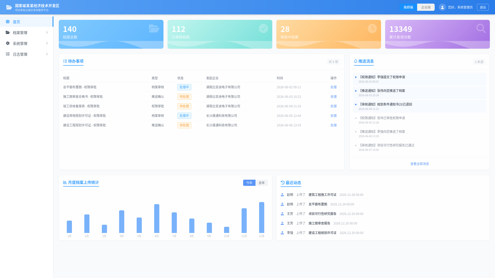

# 云端档案共享库 - 原型系统

面向产业园区的云端档案共享交互系统原型。

## 原型功能

- **档案管理** — 档案查询、新增、分类管理
- **在线预览** — 对接 KKFileView，支持 PDF/图片预览
- **推送功能** — 政府端各部门间推送已归档档案
- **企业端** — 查看本企业项目档案、撤回、送审
- **角色切换** — 支持政府端/企业端视图切换（Mock 数据）

## 使用方式

直接打开 `protosystem/index.html` 即可，无需构建。

## 技术栈

- 纯前端 HTML + CSS + JavaScript
- Tailwind CSS（CDN）
- FontAwesome 6.4（CDN）
- 数据为硬编码 Mock 数据（约 140 条档案）
